# GitHub Copilot para los amantes de SAP 💙

NOTA: Aunque es una característica muy útil, no podemos utilizar dev containers en el contexto de Repsol, ten en cuenta que no tenemos permisos de admin sobre la máquina. Igual que para node si he encontrado una forma de instalarlo sin necesidad de tener permisos de admin, tenemos que simplificar la configuración del entorno de trabajo. Si te parece quito la parte de docker. También partiría de un paso anterior, hablar de un repositorio Git a un desarrollador SAP es como pedir peras a un Olmo. 

- Clona este repo 👩‍💻
- O también puedes ejecutarlo en GitHub Codespaces 🐈‍⬛ [Echa un vistazo a este vídeo](https://www.youtube.com/watch?v=0qKG37C8sb8)

## Demos con Copilot Chat

### General

1. ¿Qué tipos de desarrollos hay en SAP? 🤔

### Desarrollo de aplicaciones web con SAPUI5

#### Requisitos 

Para poder seguir trabajando necesitamos tener configurado nodejs en la máquina. Por norma general, no tenemos permisos admin en las VDI ni en los PCs corporativos.
También es necesario tener instalado Git. 

2. ¿Cómo puedo instalar nodejs en mi máquina si no tengo permisos de administrador?

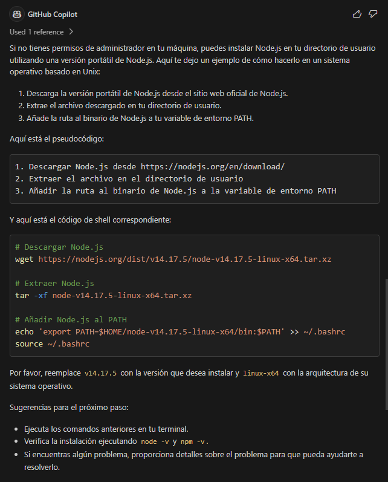

3. ¿Cómo puedo instalar Git en una máquina windows?

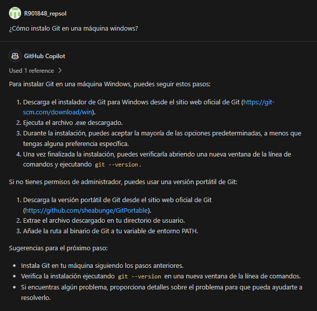

4. ¿Cómo clono este repositorio en VSCode?

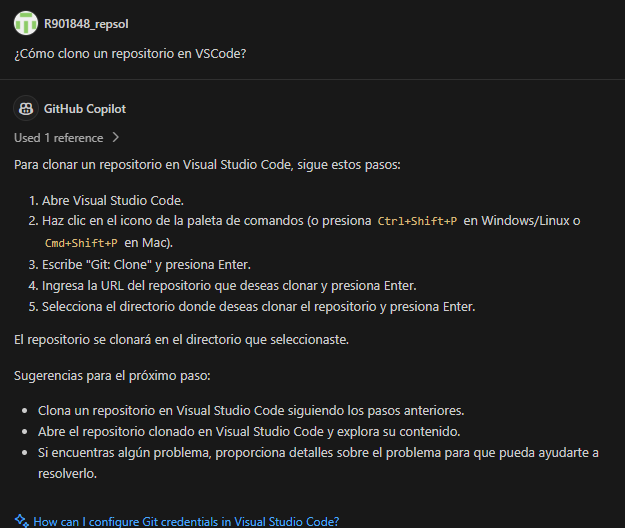

5. ¿Cómo puedo crear una aplicación SAPUI5? 🤔
Esta respuesta solo es válida para inicializar un aplicación SAPUI5 en base a una definición. 
No he encontrado forma que copilot de una respuesta coherente para crear una app SAPUI5, ten en cuenta que
este tipo de desarrollos están preparados para realizarlos en el IDE propio de SAP (SAP BAS)
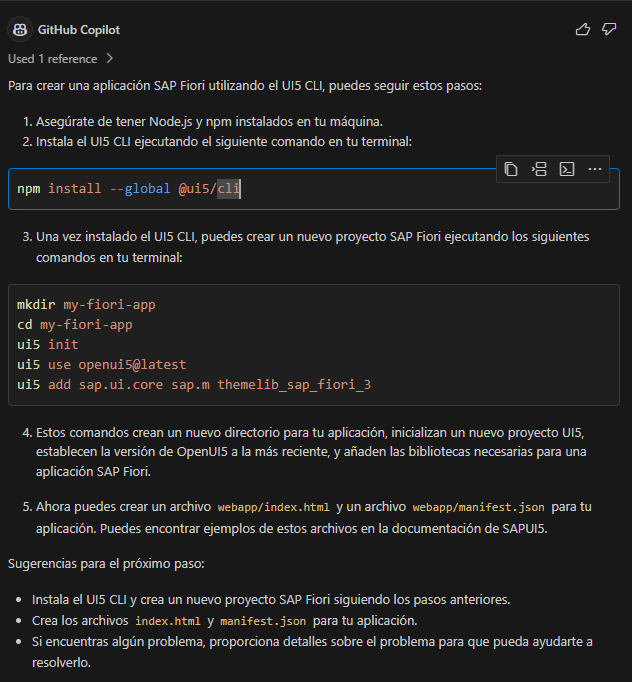

6. ¿Qué extensiones tengo que utilizar para trabajar con SAPUI5 en VSCode?
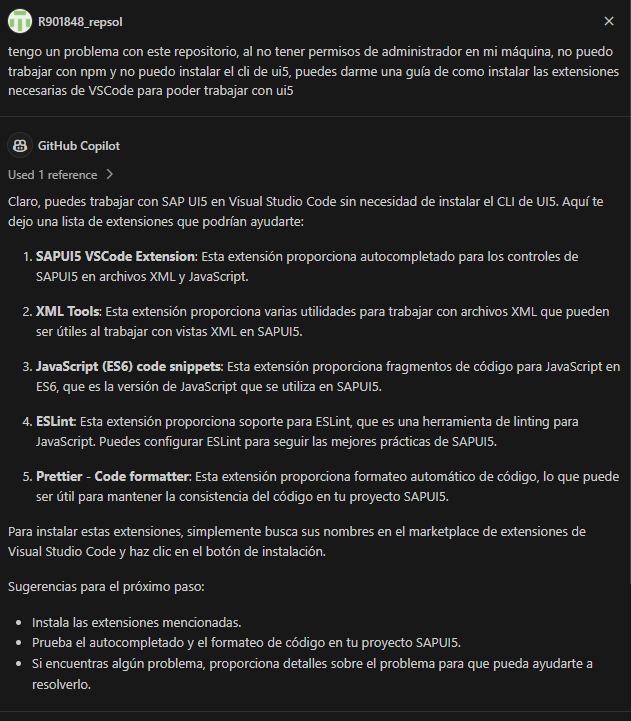

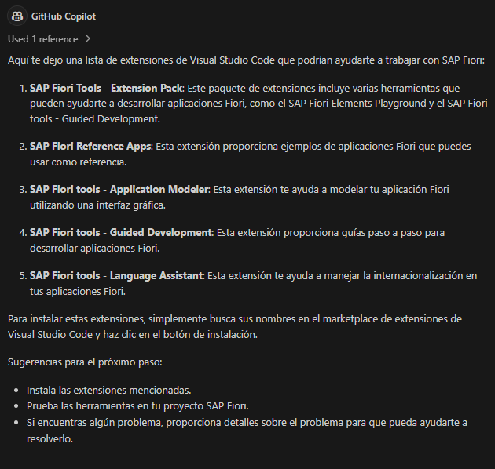

A partir de aquí es necesario crear el proyecto utilizando el wizard de la extensión

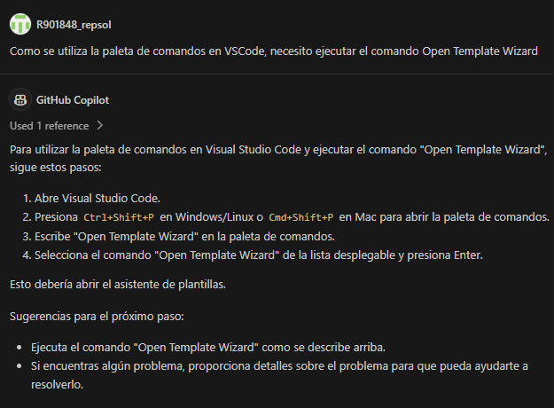

7. ¿Como pruebo el proyecto en local?

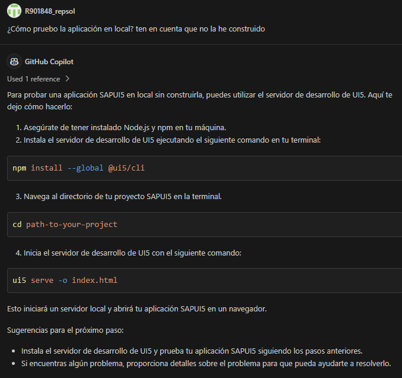

8. A partir del fichero metadata.xml  construye una vista que contenga una tabla con los campos de la entidad employee y otra vista que al pulsar sobre el elemento de la tabla navegue al detalle de employee
 
Este fichero contiene la implementación del servicio OData, he utilizado uno de prueba https://services.odata.org/V3/Northwind/Northwind.svc/$metadata

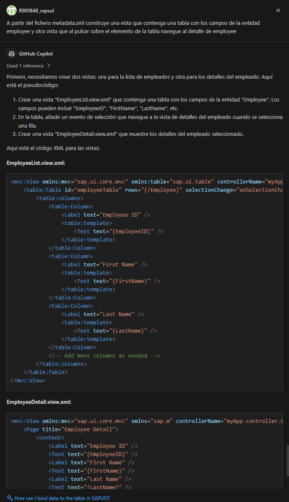

9. Como sabemos que la navegación no la queremos implementar en código, preferimos que la parametrice en las rutas. 

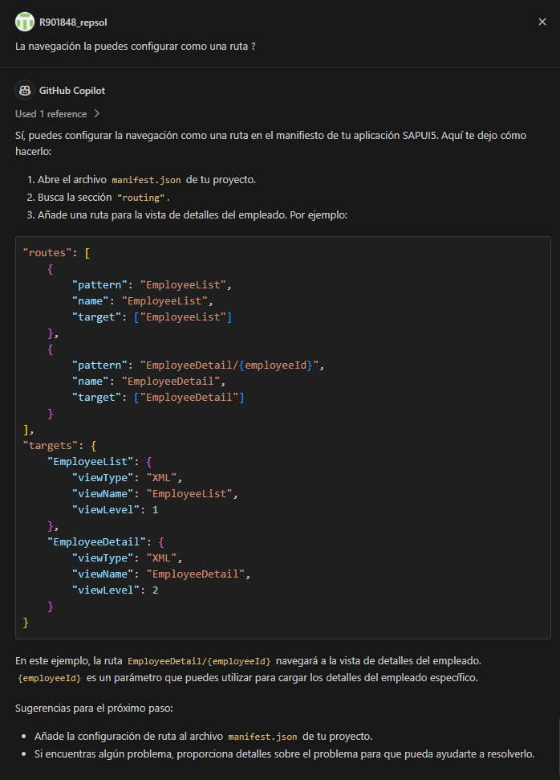

10. ¿Cómo puedo desplegar mi aplicación SAPUI5 en un servidor?
Esta pregunta aunque te la puede resolver Copilot, ya hay un procedimiento establecido en Repsol para realizar los despliegues. 

### Desarrollo ABAP

1. ¿Cómo puedo crear un programa ABAP? 🤔

2. Abre **class_excel_reader.abap** y pregunta: ¿Qué hace este código? 🤔

3. Usando el mismo archivo ¿Puedes hacer test unitarios en ABAP? 🤔

4. ¿Cómo puedo consumir una API REST con autenticación OAuth en ABAP? 🤔

5. Crea un programa ABAP que obtenga los nombres de todos los textos fuente ABAP de un paquete. Todos los programas se encuentran en la tabla TRDIR de la base de datos. Para acceder al código de los programas de un determinado paquete, antes tendrás que recoger de la tabla TADIR todos aquellos objetos contenidos en dicho paquete. La clave primaria de la tabla TADIR se compone de los siguientes campos: PGMID, OBJECT, OBJ_NAME y a la TRDIR se podría acceder con aquellos registros cuyo NAME coincida con el OBJ_NAME de la TADIR. Ten en cuenta que la versión es la 7.50 y que quiero que esté enfocado en el rendimiento

6. Quiero montar una ALV para visualizar los resultados

7. ¿Pero seguro que no se puede mejorar el rendimiento?

8. ¿Puedes documentar este código?

9. ¿Puedes revisar si existe algún problema en el código?

10. ¿Puedes incluir el manejo de excepciones?

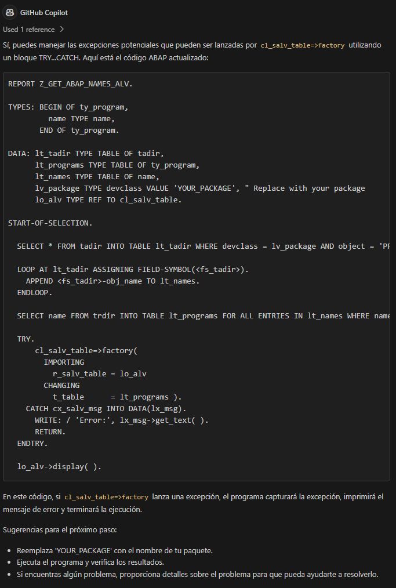

### Enlaces de interés
- [SAP Business Technology Platform](https://www.sap.com/products/business-technology-platform.html)
- [SAP Business Application Studio](https://www.sap.com/products/business-application-studio.html)
- [SAP Fiori](https://www.sap.com/products/fiori.html)
- [Desarrollo de SAPUI5](https://blogs.sap.com/2023/11/02/sapui5-development-with-sap-build-code/)
- [Configurar Visual Studio Code para UI5](https://blogs.sap.com/2021/02/03/setting-up-visual-studio-code-for-ui5-development/)
- [Tutoriales de SAP](https://developers.sap.com/tutorial-navigator.html)
- [abapGit](https://github.com/abapGit/abapGit)
- [Ejemplos en ABAP](https://github.com/SAP-samples/abap-platform-rap-opensap/tree/main)